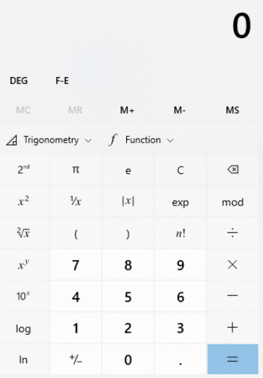
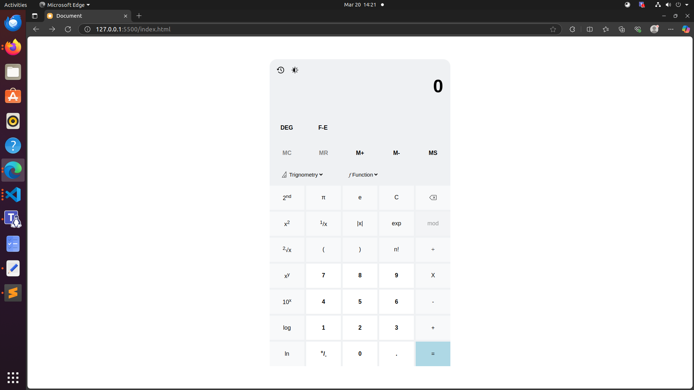
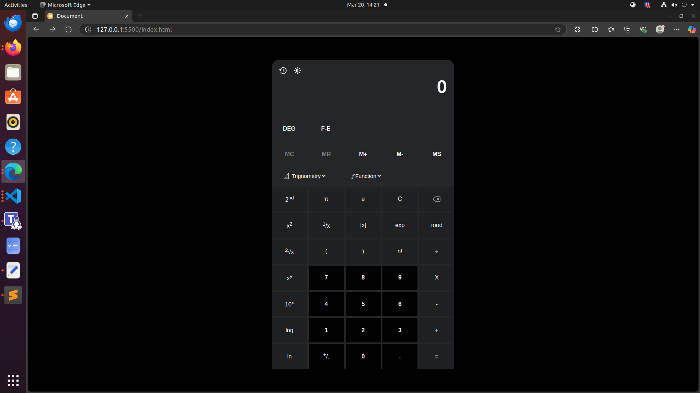

# Scientific Calculator

## This is a scientific calculator which is used to resolve a mathematical expression.

- ### I have covered basic operations, trignometric functions, ceil and floor function, Conversion from degree to radian for trignometric functions, fraction to exponential conversion, memory operations like M+, M-, MS, MR, MC and extra functionalities like light-dark mode, keyboard input, history for all calculations

#### Taken inspiration from:-

#### Website's UI performance:-

#### Screenshots of project:-

- #### To experience the website, kindly visit: https://calculator-application-advanced-op.netlify.app/

# Thankyou for visiting
